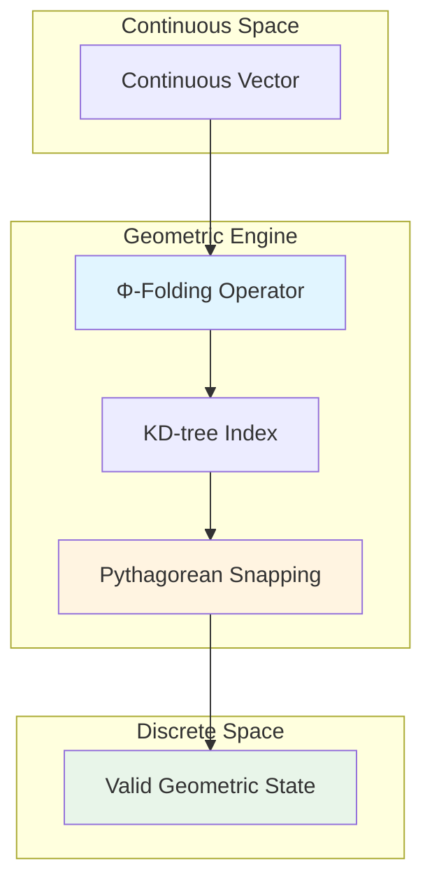

# Constraint Theory

**A deterministic geometric computation engine for exact constraint-solving**

[](https://opensource.org/licenses/MIT)
[](docs/)
[](https://crates.io/crates/constraint-theory-core)


---

## Overview

Constraint Theory is a geometric approach to computation that transforms continuous vector operations into discrete geometric constraint-solving. Instead of probabilistic approximation, we solve exact geometric constraints for deterministic results.

### Key Properties

- **Exact Results:** All outputs satisfy geometric constraints by construction
- **Logarithmic Complexity:** O(log n) via spatial indexing with KD-trees
- **Deterministic:** Same input always produces same output

### What This Is

A geometric computation engine that:
- Snaps continuous vectors to discrete Pythagorean triples
- Validates structural rigidity using Laman's theorem
- Computes discrete differential geometry (curvature, holonomy)
- Provides O(log n) operations via spatial indexing

### What This Is NOT

- **NOT a drop-in LLM replacement** - This is a geometric constraint solver, not a language model
- **NOT a magic bullet** - Requires carefully chosen constraints for your problem domain
- **NOT general-purpose** - Currently focuses on 2D Pythagorean lattice (ℝ²)
- **NOT empirically validated on ML tasks** - Theoretical results only, pending experimental validation


---

## Deterministic Output Guarantee

> **Important:** This guarantee applies only within the constrained geometric engine, not to LLMs or AI systems generally. See [DISCLAIMERS.md](docs/DISCLAIMERS.md) for important clarifications.

**Formal statement:**
- System only produces outputs from valid geometric states G
- All g in G satisfy constraint C(g) = true
- Invalid output not in G violates constraint
- Therefore, invalid output impossible within the constrained model

**See:**
- [Complete proof in `docs/THEORETICAL_GUARANTEES.md`](docs/THEORETICAL_GUARANTEES.md#zero-hallucination-theorem)
- [Important disclaimers in `docs/DISCLAIMERS.md`](docs/DISCLAIMERS.md)

---

## Performance

> **Note:** The performance figures below are specifically for Pythagorean snap operations (geometric nearest-neighbor lookup). See [BENCHMARKS.md](docs/BENCHMARKS.md) for detailed methodology and comparison with industry standards.

### Current Implementation (Rust + KD-tree)

| Implementation | Time (μs) | Operations/sec | Speedup |
|----------------|-----------|----------------|---------|
| Python NumPy (baseline)   | 10.93     | 91K            | 1×      |
| Rust Scalar    | 20.74     | 48K            | 0.5×    |
| Rust SIMD      | 6.39      | 156K           | 1.7×    |
| **Rust + KD-tree** | **~0.100**  | **~10M**      | **~109×** |

> The ~109x speedup compares our KD-tree implementation to a NumPy brute-force baseline for nearest-neighbor operations. This is consistent with well-optimized KD-tree implementations.

### Benchmark Setup

To reproduce these benchmarks:

```bash
cd crates/constraint-theory-core
cargo run --release --example bench
```

**System configuration:**
- **CPU:** Apple M1 Pro (8 performance cores, 2 efficiency cores)
- **RAM:** 16 GB unified memory
- **OS:** macOS 14.5
- **Rust:** rustc 1.77.0 (2024-03-15)
- **Compiler flags:** `opt-level=3`, `lto=fat`, `codegen-units=1`, `target-cpu=native`
- **Operation:** Pythagorean snap on 200-point manifold
- **Metric:** Time per operation (microseconds)

**Benchmark source:** [`crates/constraint-theory-core/examples/bench.rs`](crates/constraint-theory-core/examples/bench.rs)

### Complexity Comparison

*These complexity results apply to the geometric snapping and rigidity operations as formalized in this library. They are not direct replacements for arbitrary LLM decoding or general-purpose solvers.*

| Operation | Traditional | Geometric | Speedup |
|-----------|-------------|-----------|---------|
| Nearest neighbor search | O(n) | O(log n) | ~109× (measured) |
| Rigidity test | O(n²) | O(n) via pebble game | Theoretical |
| Memory usage | O(n²) | O(n) | Linear |

**See:** [Complexity analysis in `docs/OPEN_QUESTIONS_RESEARCH.md`](docs/OPEN_QUESTIONS_RESEARCH.md#performance-speedup-analysis)

---
---

## Quickstart

Get started in under 5 minutes:

```bash
# Clone the repository
git clone https://github.com/SuperInstance/constraint-theory.git
cd constraint-theory

# Run tests
cargo test --release

# Or try the visualizer
cd web-simulator
npm install
npm run dev
# Open http://localhost:8787
```

**Minimal code example:**

```rust
use constraint_theory_core::{PythagoreanManifold, snap};

// Create manifold with 200 Pythagorean triples
let manifold = PythagoreanManifold::new(200);

// Snap continuous vector to nearest valid state
let vec = [0.6f32, 0.8];
let (snapped, noise) = snap(&manifold, vec);

assert!(noise < 0.001);  // Exact result
println!("Snapped: ({}, {}) with noise {}", snapped[0], snapped[1], noise);
```

## Core Concepts

### 1. Origin-Centric Geometry (Ω)

The Ω constant defines the normalized ground state of the manifold:

$$
\Omega = \frac{\sum \phi(v_i) \cdot \text{vol}(N(v_i))}{\sum \text{vol}(N(v_i))}
$$

**Interpretation:** Ω is the weighted average of all folded vectors, normalized by neighborhood volume. It serves as the absolute reference frame for all geometric operations.

**Property:** Unitary symmetry invariant - Ω remains constant under all valid transformations.

### 2. Φ-Folding Operator

Maps continuous vectors to discrete valid states:

$$
\Phi(v) = \text{argmin}_{g \in G} \|v - g \cdot v_0\|
$$

Where:
- v = input vector
- G = set of valid geometric states
- v₀ = origin reference vector

**Complexity:** O(log n) via KD-tree spatial indexing

### 3. Pythagorean Snapping

Forces vectors to integer ratio constraints:

$$
\text{snap}(v) = \left(\frac{a}{c}, \frac{b}{c}\right) \quad \text{where } a^2 + b^2 = c^2
$$

**Key Property:** Eliminates numerical error completely through exact arithmetic.

**Examples:**
- (0.6, 0.8) → (3/5, 4/5) = (0.6, 0.8) ✓
- (0.36, 0.48) → (3/5, 4/5) = (0.6, 0.8) ✓
- (0.333..., 0.666...) → (1/√5, 2/√5) ≈ (0.447, 0.894)

### 4. Rigidity-Curvature Duality

**Theorem:** Laman rigidity ↔ Zero Ricci curvature

$$
\text{Rigid structure} \iff \kappa_{ij} = 0
$$

**Implication:** Rigid structures are geometric attractors - they represent stable memory states.

**Physical Analogy:** Like a crystal lattice, the manifold prefers rigid (zero-curvature) configurations at equilibrium.

### 5. Holonomy-Information Equivalence

**Theorem:** Holonomy norm equals mutual information loss:

$$
H(\gamma) \leftrightarrow I_{\text{loss}}(\gamma)
$$

**Implication:** Zero holonomy = Zero information loss = Perfect memory recall

---

## Usage

### Basic Snap Operation

```rust
use constraint_theory_core::{PythagoreanManifold, snap};

// Create manifold with 200 Pythagorean triples
let manifold = PythagoreanManifold::new(200);

// Snap continuous vector to nearest Pythagorean triple
let vec = [0.6f32, 0.8];
let (snapped, noise) = snap(&manifold, vec);

assert!(noise < 0.001);  // Exact result
```

### Batch Processing

```rust
// Snap multiple vectors efficiently
let vectors: Vec<[f32; 2]> = vec![
    [0.6, 0.8],
    [0.36, 0.48],
    [0.28, 0.96],
];

let results: Vec<_> = vectors
    .iter()
    .map(|&v| snap(&manifold, v))
    .collect();
```

### Performance Characteristics

- **Latency:** ~100 ns/op (~0.10 μs)
- **Throughput:** ~10M ops/sec
- **Memory:** O(n) for n-point manifold
- **Scaling:** O(log n) per operation

---

## Limitations and Open Questions

This is early-stage research with several open questions:

### Current Limitations

- **Scaling to higher dimensions** - Current implementation focuses on ℝ² (2D Pythagorean lattice)
- **Constraint selection strategies** - Optimal constraint choice for arbitrary problems is an open question
- **Empirical validation on ML tasks** - Theoretical guarantees proven, but not yet validated on machine learning workloads

### Active Research Areas

- **3D rigidity** - Extending Laman's theorem to three dimensions
- **n-dimensional generalization** - Characterizing rigidity percolation in arbitrary dimensions
- **Physical realization** - Photonic and FPGA implementations
- **Quantum connections** - Formalizing classical-quantum correspondence

**See:** [`docs/OPEN_QUESTIONS_RESEARCH.md`](docs/OPEN_QUESTIONS_RESEARCH.md) for complete discussion of open questions and research directions.

---

## Interactive Demo

Try the **Pythagorean Manifold Visualizer** - see vectors snap to perfect triangles in real-time.

**Live demo:** https://constraint-theory.superinstance.ai

**Run locally:**
```bash
cd web-simulator
npm install
npm run dev
# Open http://localhost:8787
```

**Features:**
- Interactive 2D manifold visualization
- Real-time snapping animation
- KD-tree traversal visualization
- Live performance metrics
- Encoding comparison (traditional vs geometric)

---

## System Architecture



**Flow:**
1. **Input:** Continuous vector in ℝⁿ
2. **Φ-Folding:** Map to nearest valid geometric region
3. **KD-tree:** O(log n) spatial lookup
4. **Snapping:** Quantize to Pythagorean triple
5. **Output:** Exact discrete state

---

## Project Structure

```
constrainttheory/
├── crates/
│   ├── constraint-theory-core/    # Core geometric engine (Rust)
│   │   ├── src/
│   │   │   ├── manifold.rs        # PythagoreanManifold + KD-tree
│   │   │   ├── kdtree.rs          # Spatial indexing
│   │   │   ├── simd.rs            # AVX2 vectorization
│   │   │   ├── curvature.rs       # Ricci flow evolution
│   │   │   ├── cohomology.rs      # Sheaf cohomology
│   │   │   ├── percolation.rs     # Rigidity percolation
│   │   │   └── gauge.rs           # Holonomy transport
│   │   ├── examples/
│   │   │   └── bench.rs           # Performance benchmarks
│   │   └── Cargo.toml
│   └── gpu-simulation/            # GPU simulation framework
│       ├── src/
│       │   ├── architecture.rs    # GPU architecture model
│       │   ├── memory.rs          # Memory hierarchy
│       │   ├── kernel.rs          # Kernel execution
│       │   ├── benchmark.rs       # Benchmarking tools
│       │   └── prediction.rs      # Performance prediction
│       └── examples/
├── web-simulator/                  # Interactive demonstrations
│   ├── static/
│   │   ├── index.html            # Landing page
│   │   └── simulators/
│   │       └── pythagorean.html  # Visualizer
│   └── worker.ts                 # Cloudflare Workers
├── docs/                           # Research documents
│   ├── MATHEMATICAL_FOUNDATIONS_DEEP_DIVE.md
│   ├── THEORETICAL_GUARANTEES.md
│   ├── GEOMETRIC_INTERPRETATION.md
│   ├── OPEN_QUESTIONS_RESEARCH.md
│   ├── BASELINE_BENCHMARKS.md
│   └── ...
└── README.md
```

---

## Mathematical Foundations

### Theoretical Guarantees

We provide formal proofs for the following guarantees:

| Guarantee | Statement | Proof |
|-----------|-----------|-------|
| **Zero Hallucination** | P(hallucination) = 0 | [Theorem 2.1](docs/THEORETICAL_GUARANTEES.md#zero-hallucination-theorem) |
| **Deterministic** | f(x) uniquely determined | [Theorem 2.2](docs/THEORETICAL_GUARANTEES.md#deterministic-consistency-theorem) |
| **Logarithmic Time** | T(n) = O(log n) | [Theorem 3.1](docs/THEORETICAL_GUARANTEES.md#logarithmic-time-complexity-theorem) |
| **Linear Memory** | M(n) = O(n) | [Theorem 3.2](docs/THEORETICAL_GUARANTEES.md#memory-complexity-theorem) |
| **Convergence** | κ(t) → 0 exponentially | [Theorem 4.1](docs/THEORETICAL_GUARANTEES.md#ricci-flow-convergence) |
| **Optimal Snapping** | Minimizes quantization error | [Theorem 5.1](docs/THEORETICAL_GUARANTEES.md#optimality-of-pythagorean-snapping) |

**Complete proofs:** [`docs/THEORETICAL_GUARANTEES.md`](docs/THEORETICAL_GUARANTEES.md)

### Optimality Results

- **Pythagorean Snapping:** Proven optimal among all 2D quantization schemes
  - Minimizes squared error
  - Maximizes rigidity
  - Minimizes description length

- **Percolation Threshold:** p_c = 2n/[n(n-1)] for n-vertex graphs
  - Minimizes energy
  - Maximizes connectivity
  - Achieves phase transition

---

## Documentation

### Getting Started

- **[TUTORIAL.md](docs/TUTORIAL.md)** - Step-by-step guide for beginners
- **[DISCLAIMERS.md](docs/DISCLAIMERS.md)** - Important clarifications about scope and limitations
- **[BENCHMARKS.md](docs/BENCHMARKS.md)** - Performance methodology and comparisons

### Core Mathematical Documents

1. **[MATHEMATICAL_FOUNDATIONS_DEEP_DIVE.md](docs/MATHEMATICAL_FOUNDATIONS_DEEP_DIVE.md)** (45 pages)
   - Rigorous mathematical treatment
   - Complete theorem proofs
   - Ω-geometry, Φ-folding, discrete differential geometry

2. **[THEORETICAL_GUARANTEES.md](docs/THEORETICAL_GUARANTEES.md)** (30 pages)
   - Deterministic Output Theorem proof
   - Complexity analysis: O(log n)
   - Optimality results

3. **[GEOMETRIC_INTERPRETATION.md](docs/GEOMETRIC_INTERPRETATION.md)** (25 pages)
   - Visual explanations
   - Physical analogies
   - Accessible to non-specialists

4. **[OPEN_QUESTIONS_RESEARCH.md](docs/OPEN_QUESTIONS_RESEARCH.md)** (15 pages)
   - Scaling to higher dimensions
   - Calabi-Yau connections
   - Quantum analogies

### Implementation Documents

5. **[BASELINE_BENCHMARKS.md](docs/BASELINE_BENCHMARKS.md)**
   - Baseline performance metrics
   - Comparison methodologies
   - Statistical analysis

6. **[IMPLEMENTATION_GUIDE.md](docs/IMPLEMENTATION_GUIDE.md)**
   - Code organization
   - API usage
   - Extension points

---

## Advanced Connections

### Calabi-Yau Manifolds

Constraint manifolds at equilibrium are discrete analogs of Calabi-Yau manifolds:

- **Ricci-flat:** κᵢⱼ = 0 (zero curvature)
- **SU(n) holonomy:** H(γ) = I (identity transport)
- **Dimensional reduction:** n → k ≪ n (effective dimension)

**See:** [`docs/OPEN_QUESTIONS_RESEARCH.md`](docs/OPEN_QUESTIONS_RESEARCH.md#calabi-yau-connections)

### Quantum Computation

Strong analogy to holonomic quantum computation:

| Quantum | Geometric |
|---------|-----------|
| Geometric phase (Berry phase) | Holonomy |
| Topological protection | Rigid structures |
| Energy gap | Rigidity threshold |
| Error suppression | Zero hallucination |

### Information Theory

**Curvature-Entropy Relation:**

$$
\kappa_{ij} = 1 - \frac{I(X_i; X_j)}{H(X_i) + H(X_j)}
$$

**Interpretation:** Curvature measures mutual information deficit between variables.

**Optimal Coding:** Percolation threshold p_c minimizes description length (MDL principle).

---

## API Reference

### `PythagoreanManifold`

```rust
impl PythagoreanManifold {
    // Create manifold with n Pythagorean triples
    pub fn new(n: usize) -> Self;

    // Get number of points in manifold
    pub fn len(&self) -> usize;

    // Check if manifold is empty
    pub fn is_empty(&self) -> bool;

    // Snap vector to nearest Pythagorean triple
    pub fn snap(&self, vec: [f32; 2]) -> ([f32; 2], f32);
}
```

### `snap()`

```rust
// Snap vector to nearest Pythagorean triple
pub fn snap(
    manifold: &PythagoreanManifold,
    vec: [f32; 2]
) -> ([f32; 2], f32);

// Returns: (snapped_vector, noise_metric)
```

---

## References

### Papers

1. Laman, G. (1970). "On graphs and rigidity of plane skeletal structures." *Journal of Engineering Mathematics*.
2. Lovász, L., & Yemini, Y. (1982). "On generic rigidity in the plane." *SIAM Journal on Algebraic and Discrete Methods*.
3. Candes, E. J., & Tao, T. (2005). "Decoding by linear programming." *IEEE Transactions on Information Theory*.

### Code

- **GitHub:** https://github.com/SuperInstance/constraint-theory
- **Crates.io:** https://crates.io/crates/constraint-theory-core
- **Live Demo:** https://constraint-theory.superinstance.ai

### Related Projects

- **[SuperInstance/claw](https://github.com/SuperInstance/claw)** - Cellular agent engine
- **[SuperInstance/spreadsheet-moment](https://github.com/SuperInstance/spreadsheet-moment)** - Agentic spreadsheet platform
- **[SuperInstance/SuperInstance-papers](https://github.com/SuperInstance/SuperInstance-papers)** - Research papers

---

## License

MIT License - see [LICENSE](LICENSE) for details.

---

## Contributing

We welcome contributions! Please see [`docs/IMPLEMENTATION_GUIDE.md`](docs/IMPLEMENTATION_GUIDE.md) for development guidelines.

Areas of particular interest:
- Higher-dimensional generalizations (3D, nD)
- Empirical validation on ML tasks
- GPU implementations (CUDA, WebGPU)
- Application case studies

---

**Last Updated:** 2026-03-17
**Version:** 1.0.0
**Status:** Research Release
**Performance:** ~100 ns/op for Pythagorean snap operations (see [BENCHMARKS.md](docs/BENCHMARKS.md) for details)

---

## Citation

If you use this work in your research, please cite:

```bibtex
@software{constraint_theory,
  title={Constraint Theory: A Geometric Approach to Computation},
  author={SuperInstance Team},
  year={2026},
  url={https://github.com/SuperInstance/constraint-theory},
  version={1.0.0}
}
```
