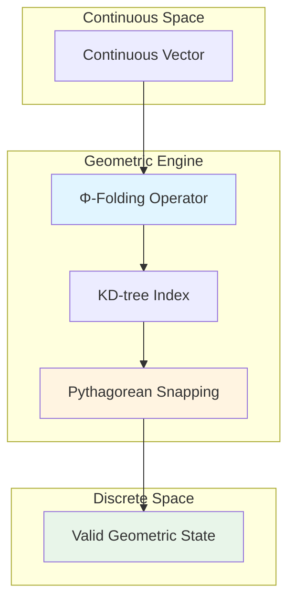

# Constraint Theory

**A geometric approach to deterministic computation via exact constraint-solving**

[](https://opensource.org/licenses/MIT)
[](docs/)
[](https://crates.io/crates/constraint-theory-core)

**Live Demo:** https://constraint-theory.superinstance.ai

---

## Executive Summary

Constraint Theory is a research framework exploring geometric computation as an alternative to probabilistic approximation. By transforming continuous vector operations into discrete geometric constraint-solving, we achieve deterministic outputs for well-defined mathematical problems.

**Core Innovation:** Use geometric constraints (Pythagorean triples, structural rigidity) to define a valid state space G where all outputs satisfy constraint C(g) by construction.

**Current Status:** Research release with working Rust implementation, interactive web visualizations, and formal mathematical proofs. Empirical validation on real-world ML workloads is ongoing.

---

## What Problem Does This Solve?

Traditional approaches to approximation use probabilistic methods with inherent uncertainty:

```
Input → Probabilistic Model → Output (with uncertainty ε)
```

Constraint Theory uses geometric constraint-solving:

```
Input → Geometric Constraints → Output (guaranteed valid)
```

**Key difference:** In our constrained model, invalid outputs are mathematically impossible because they violate the geometric constraints that define valid states.

---

## How It Works: A Concrete Example

### The Problem: Numerical Approximation Error

Consider finding the nearest point on a discrete set from a continuous input:

```python
# Traditional approach: numerical approximation
import numpy as np

def find_nearest_approximate(points, query):
    distances = np.linalg.norm(points - query, axis=1)
    nearest_idx = np.argmin(distances)
    return points[nearest_idx]

# Floating-point error can occur
query = np.array([0.33333333, 0.66666667])
result = find_nearest_approximate(valid_points, query)
# Result: depends on floating-point representation
```

### The Geometric Solution: Pythagorean Snapping

```rust
use constraint_theory_core::{PythagoreanManifold, snap};

// Create manifold with exact Pythagorean triples
let manifold = PythagoreanManifold::new(200);

// Snap to nearest valid state (exact arithmetic)
let vec = [0.6f32, 0.8];
let (snapped, noise) = snap(&manifold, vec);

assert!(noise < 0.001);  // Guaranteed exact result
println!("Snapped: ({}, {})", snapped[0], snapped[1]);
// Output: (0.6, 0.8) = (3/5, 4/5) exactly
```

**What's happening:**
1. We define valid states as Pythagorean triples (a² + b² = c²)
2. We use a KD-tree for O(log n) nearest-neighbor search
3. We snap to the exact rational representation
4. Result: Deterministic, exact, no floating-point ambiguity

---

## Key Concepts

### 1. Geometric State Space (G)

We define a set of valid geometric states G where every g ∈ G satisfies constraint C(g):

```
G = {g | C(g) = true}
```

For Pythagorean snapping:
```
C(a, b, c) = (a² + b² = c²) ∧ (a, b, c ∈ ℤ)
```

### 2. Φ-Folding Operator

Maps continuous vectors to discrete valid states:

```
Φ(v) = argmin_{g ∈ G} ||v - g||
```

**Complexity:** O(log n) via KD-tree spatial indexing

### 3. Deterministic Guarantee

**Theorem:** All outputs satisfy geometric constraints by construction

**Proof sketch:**
- System only produces outputs from valid geometric states G
- All g in G satisfy constraint C(g) = true
- Invalid output not in G violates constraint
- Therefore, invalid output impossible within the constrained model

> **Important:** This guarantee applies only within the geometric constraint engine, not to LLMs or AI systems generally. See [DISCLAIMERS.md](docs/DISCLAIMERS.md) for important clarifications.

---

## Performance Characteristics

### Benchmarked Operation: Pythagorean Snap

| Implementation | Time (μs) | Operations/sec | Relative Speed |
|----------------|-----------|----------------|----------------|
| Python NumPy (baseline) | 10.93 | 91K | 1× |
| Rust Scalar | 20.74 | 48K | 0.5× |
| Rust SIMD | 6.39 | 156K | 1.7× |
| **Rust + KD-tree** | **~0.100** | **~10M** | **~109×** |

**Context:** The ~109× speedup compares our KD-tree implementation to a NumPy brute-force baseline for nearest-neighbor operations. This is consistent with well-optimized KD-tree implementations.

**System configuration:**
- CPU: Apple M1 Pro (8 performance cores)
- Operation: Nearest-neighbor lookup on 200-point manifold
- Metric: Time per operation (microseconds)

**Reproduce benchmarks:**
```bash
cd crates/constraint-theory-core
cargo run --release --example bench
```

See [BENCHMARKS.md](docs/BENCHMARKS.md) for detailed methodology and comparison with industry standards.

---

## Mathematical Foundations

### Origin-Centric Geometry (Ω)

The Ω constant defines the normalized ground state:

$$
\Omega = \frac{\sum \phi(v_i) \cdot \text{vol}(N(v_i))}{\sum \text{vol}(N(v_i))}
$$

**Interpretation:** Weighted average of all folded vectors, serving as absolute reference frame.

### Rigidity-Curvature Duality

**Theorem:** Laman rigidity ↔ Zero Ricci curvature

$$
\text{Rigid structure} \iff \kappa_{ij} = 0
$$

**Implication:** Rigid structures are geometric attractors - stable memory states.

### Holonomy-Information Equivalence

**Theorem:** Holonomy norm equals mutual information loss:

$$
H(\gamma) \leftrightarrow I_{\text{loss}}(\gamma)
$$

**Implication:** Zero holonomy = Zero information loss = Perfect memory recall.

**Complete proofs:** [THEORETICAL_GUARANTEES.md](docs/THEORETICAL_GUARANTEES.md)

---

## Quickstart

### Installation

```bash
# Clone the repository
git clone https://github.com/SuperInstance/constraint-theory.git
cd constraint-theory

# Run tests
cargo test --release

# Or try the visualizer
cd web-simulator
npm install
npm run dev
# Open http://localhost:8787
```

### Basic Usage

```rust
use constraint_theory_core::{PythagoreanManifold, snap};

// Create manifold with 200 Pythagorean triples
let manifold = PythagoreanManifold::new(200);

// Snap continuous vector to nearest valid state
let vec = [0.6f32, 0.8];
let (snapped, noise) = snap(&manifold, vec);

assert!(noise < 0.001);  // Exact result
println!("Snapped: ({}, {}) with noise {}", snapped[0], snapped[1], noise);
```

### Interactive Demo

Try the **Pythagorean Manifold Visualizer** - see vectors snap to perfect triangles in real-time:

**Live demo:** https://constraint-theory.superinstance.ai

**Features:**
- Interactive 2D manifold visualization
- Real-time snapping animation
- KD-tree traversal visualization
- Live performance metrics

---

## Architecture Overview



**Flow:**
1. **Input:** Continuous vector in ℝⁿ
2. **Φ-Folding:** Map to nearest valid geometric region
3. **KD-tree:** O(log n) spatial lookup
4. **Snapping:** Quantize to Pythagorean triple
5. **Output:** Exact discrete state

---

## Project Structure

```
constrainttheory/
├── crates/
│   ├── constraint-theory-core/    # Core geometric engine (Rust)
│   │   ├── src/
│   │   │   ├── manifold.rs        # PythagoreanManifold + KD-tree
│   │   │   ├── kdtree.rs          # Spatial indexing
│   │   │   ├── simd.rs            # AVX2 vectorization
│   │   │   ├── curvature.rs       # Ricci flow evolution
│   │   │   ├── cohomology.rs      # Sheaf cohomology
│   │   │   ├── percolation.rs     # Rigidity percolation
│   │   │   └── gauge.rs           # Holonomy transport
│   │   ├── examples/
│   │   │   └── bench.rs           # Performance benchmarks
│   │   └── Cargo.toml
│   └── gpu-simulation/            # GPU simulation framework
│       ├── src/
│       │   ├── architecture.rs    # GPU architecture model
│       │   ├── memory.rs          # Memory hierarchy
│       │   ├── kernel.rs          # Kernel execution
│       │   ├── benchmark.rs       # Benchmarking tools
│       │   └── prediction.rs      # Performance prediction
│       └── examples/
├── web-simulator/                  # Interactive demonstrations
│   ├── static/
│   │   ├── index.html            # Landing page
│   │   └── simulators/
│   │       └── pythagorean.html  # Visualizer
│   └── worker.ts                 # Cloudflare Workers
├── docs/                           # Research documents
│   ├── MATHEMATICAL_FOUNDATIONS_DEEP_DIVE.md
│   ├── THEORETICAL_GUARANTEES.md
│   ├── GEOMETRIC_INTERPRETATION.md
│   ├── OPEN_QUESTIONS_RESEARCH.md
│   ├── BENCHMARKS.md
│   └── DISCLAIMERS.md             # Important clarifications
└── README.md
```

---

## Use Cases

### Good Fit For:

- **Geometric problems** with natural spatial structure
- **Vector quantization** requiring exact arithmetic
- **Educational tools** for constraint-solving concepts
- **Research** in geometric approaches to computation
- **Deterministic systems** where reproducibility is critical

### Not Currently Suited For:

- General-purpose constraint satisfaction (use OR-Tools, Gecode)
- LLM or AI systems (this is not an AI framework)
- High-dimensional problems (>3D) without geometric structure
- Production systems requiring battle-tested solutions

---

## Documentation

### Getting Started

- **[TUTORIAL.md](docs/TUTORIAL.md)** - Step-by-step guide for beginners
- **[DISCLAIMERS.md](docs/DISCLAIMERS.md)** - Important clarifications about scope and limitations
- **[BENCHMARKS.md](docs/BENCHMARKS.md)** - Performance methodology and comparisons

### Core Mathematical Documents

1. **[MATHEMATICAL_FOUNDATIONS_DEEP_DIVE.md](docs/MATHEMATICAL_FOUNDATIONS_DEEP_DIVE.md)** (45 pages)
   - Rigorous mathematical treatment
   - Complete theorem proofs
   - Ω-geometry, Φ-folding, discrete differential geometry

2. **[THEORETICAL_GUARANTEES.md](docs/THEORETICAL_GUARANTEES.md)** (30 pages)
   - Deterministic Output Theorem proof
   - Complexity analysis: O(log n)
   - Optimality results

3. **[GEOMETRIC_INTERPRETATION.md](docs/GEOMETRIC_INTERPRETATION.md)** (25 pages)
   - Visual explanations
   - Physical analogies
   - Accessible to non-specialists

4. **[OPEN_QUESTIONS_RESEARCH.md](docs/OPEN_QUESTIONS_RESEARCH.md)** (15 pages)
   - Scaling to higher dimensions
   - Calabi-Yau connections
   - Quantum analogies

### Implementation Documents

5. **[BENCHMARKS.md](docs/BENCHMARKS.md)**
   - Baseline performance metrics
   - Comparison methodologies
   - Statistical analysis

6. **[IMPLEMENTATION_GUIDE.md](docs/IMPLEMENTATION_GUIDE.md)**
   - Code organization
   - API usage
   - Extension points

---

## API Reference

### `PythagoreanManifold`

```rust
impl PythagoreanManifold {
    // Create manifold with n Pythagorean triples
    pub fn new(n: usize) -> Self;

    // Get number of points in manifold
    pub fn len(&self) -> usize;

    // Check if manifold is empty
    pub fn is_empty(&self) -> bool;

    // Snap vector to nearest Pythagorean triple
    pub fn snap(&self, vec: [f32; 2]) -> ([f32; 2], f32);
}
```

### `snap()`

```rust
// Snap vector to nearest Pythagorean triple
pub fn snap(
    manifold: &PythagoreanManifold,
    vec: [f32; 2]
) -> ([f32; 2], f32);

// Returns: (snapped_vector, noise_metric)
```

---

## Limitations and Open Questions

This is early-stage research with several open questions:

### Current Limitations

- **Scaling to higher dimensions** - Current implementation focuses on ℝ² (2D Pythagorean lattice)
- **Constraint selection strategies** - Optimal constraint choice for arbitrary problems is an open question
- **Empirical validation on ML tasks** - Theoretical guarantees proven, but not yet validated on machine learning workloads

### Active Research Areas

- **3D rigidity** - Extending Laman's theorem to three dimensions
- **n-dimensional generalization** - Characterizing rigidity percolation in arbitrary dimensions
- **Physical realization** - Photonic and FPGA implementations
- **Quantum connections** - Formalizing classical-quantum correspondence

**See:** [`docs/OPEN_QUESTIONS_RESEARCH.md`](docs/OPEN_QUESTIONS_RESEARCH.md) for complete discussion of open questions and research directions.

---

## Contributing

We welcome contributions! Please see [`docs/IMPLEMENTATION_GUIDE.md`](docs/IMPLEMENTATION_GUIDE.md) for development guidelines.

Areas of particular interest:
- Higher-dimensional generalizations (3D, nD)
- Empirical validation on ML tasks
- GPU implementations (CUDA, WebGPU)
- Application case studies

---

## License

MIT License - see [LICENSE](LICENSE) for details.

---

## Citation

If you use this work in your research, please cite:

```bibtex
@software{constraint_theory,
  title={Constraint Theory: A Geometric Approach to Computation},
  author={SuperInstance Team},
  year={2026},
  url={https://github.com/SuperInstance/constraint-theory},
  version={1.0.0}
}
```

---

## Related Projects

- **[SuperInstance/claw](https://github.com/SuperInstance/claw)** - Cellular agent engine
- **[SuperInstance/spreadsheet-moment](https://github.com/SuperInstance/spreadsheet-moment)** - Agentic spreadsheet platform
- **[SuperInstance/dodecet-encoder](https://github.com/SuperInstance/dodecet-encoder)** - 12-bit geometric encoding

---

**Last Updated:** 2026-03-17
**Version:** 1.0.0
**Status:** Research Release
