# Constraint Theory Web Assets

**Static assets for interactive geometric demonstrations**

---

## Asset Architecture

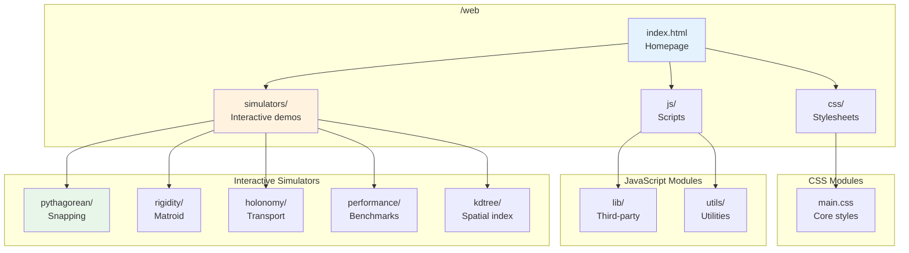

---

## Simulator Ecosystem

### Interactive Demonstrations

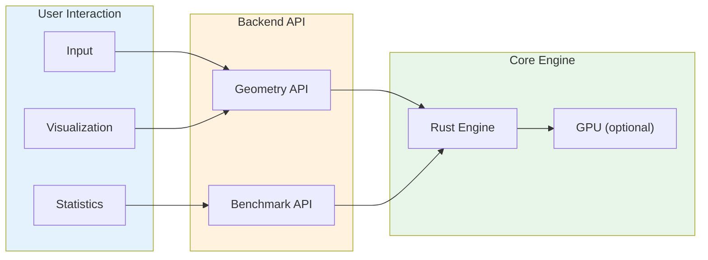

---

## Simulators

### 1. Pythagorean Snapping

**Path:** `/simulators/pythagorean/`

Interactive vector snapping to integer ratio constraints.

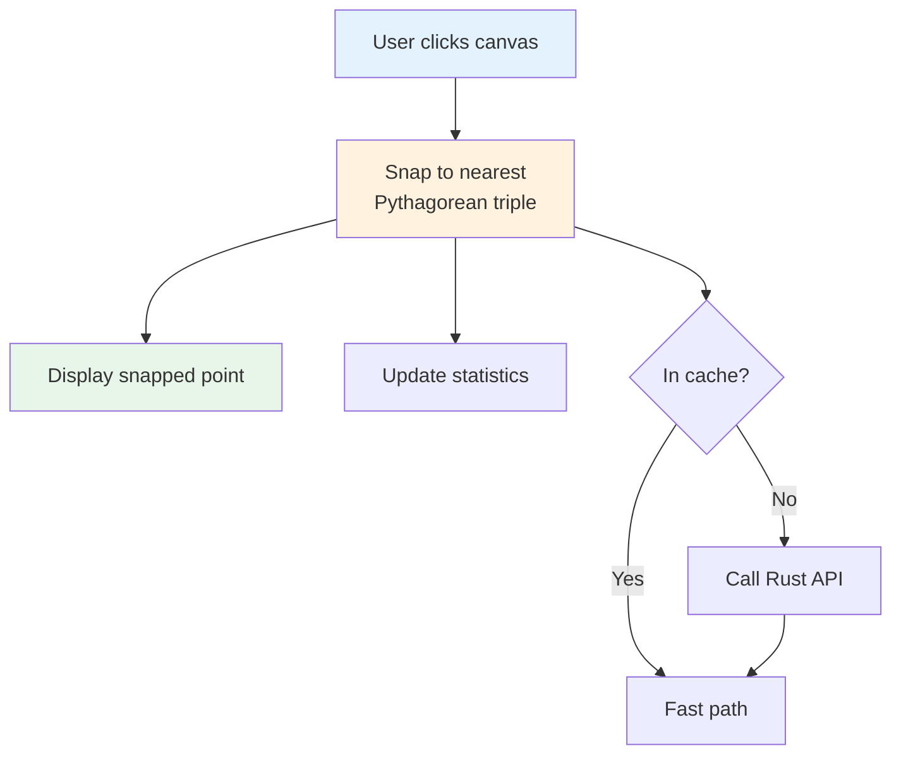

**Features:**
- Interactive canvas placement
- Real-time snapping visualization
- Adjustable snap threshold
- Integer ratio display
- Performance statistics

**API:**
```typescript
// Snap vector to integer ratio
POST /api/geometry/snap
{
  "vector": [0.6, 0.8],
  "threshold": 0.01
}

// Response
{
  "snapped": [0.6, 0.8],
  "ratio": [3, 4, 5],
  "noise": 0.0001
}
```

---

### 2. Rigidity Matroid

**Path:** `/simulators/rigidity/`

Laman graph visualization and rigidity testing.

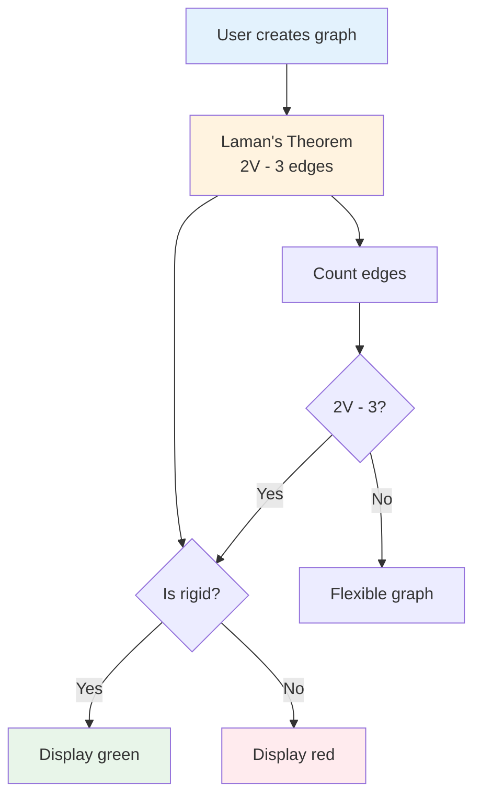

**Features:**
- Interactive graph editor
- Real-time rigidity checking
- Preset configurations
- Force-directed layout
- Visual feedback

**API:**
```typescript
// Check rigidity
POST /api/constraints/solve
{
  "vertices": [[0,0], [1,0], [0,1]],
  "edges": [[0,1], [1,2], [0,2]]
}

// Response
{
  "rigid": true,
  "degrees_of_freedom": 0,
  "laman_condition": true
}
```

---

### 3. Discrete Holonomy

**Path:** `/simulators/holonomy/`

Parallel transport visualization.

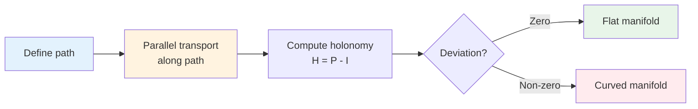

**Features:**
- 3D visualization
- Platonic solid selection
- Path drawing tools
- Deviation measurement

**API:**
```typescript
// Compute holonomy
POST /api/geometry/transform
{
  "manifold": "sphere",
  "path": [[0,0], [π/2,0], [π/2,π/2], [0,0]]
}

// Response
{
  "holonomy": {
    "norm": 0.15,
    "matrix": [[0.99, -0.01], [0.01, 0.99]]
  },
  "curvature": 1.0
}
```

---

### 4. Performance Benchmarks

**Path:** `/simulators/performance/`

Performance comparison visualization.

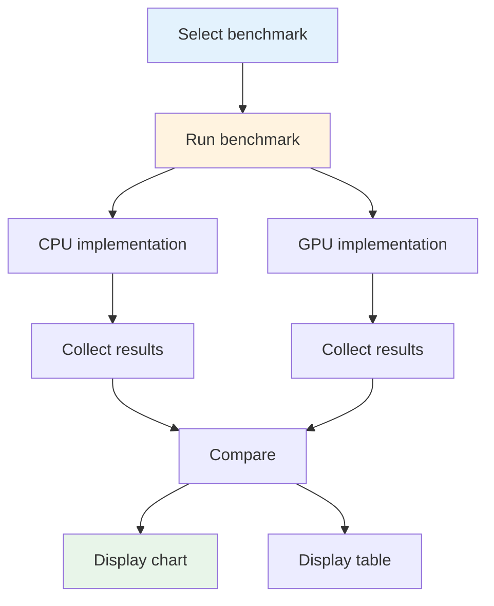

**Features:**
- Benchmark execution
- Performance comparison
- Results visualization
- Historical tracking

**API:**
```typescript
// Run benchmark
POST /api/simulators/performance/benchmark
{
  "operation": "kdtree_search",
  "size": 10000,
  "iterations": 100
}

// Response
{
  "cpu_time": 20.7,
  "gpu_time": 0.11,
  "speedup": 188,
  "operations_per_second": 4830917
}
```

---

### 5. KD-Tree Visualization

**Path:** `/simulators/kdtree/`

Spatial partitioning visualization.

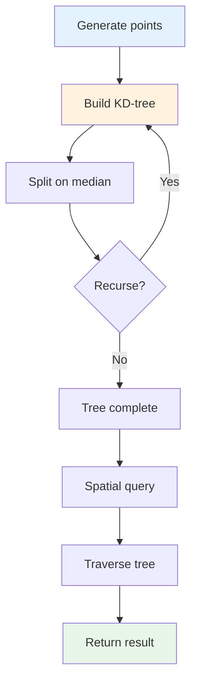

**Features:**
- Interactive construction
- Query visualization
- Performance comparison
- Tree depth control

**API:**
```typescript
// Build KD-tree
GET /api/simulators/kdtree/build?points=100

// Response
{
  "tree": {
    "depth": 7,
    "nodes": 100,
    "build_time": 0.002
  }
}

// Spatial query
POST /api/geometry/query
{
  "point": [0.5, 0.5],
  "k": 5
}

// Response
{
  "neighbors": [[0.6, 0.8], [0.4, 0.6], ...],
  "query_time": 0.0001
}
```

---

## Styling System

### CSS Architecture

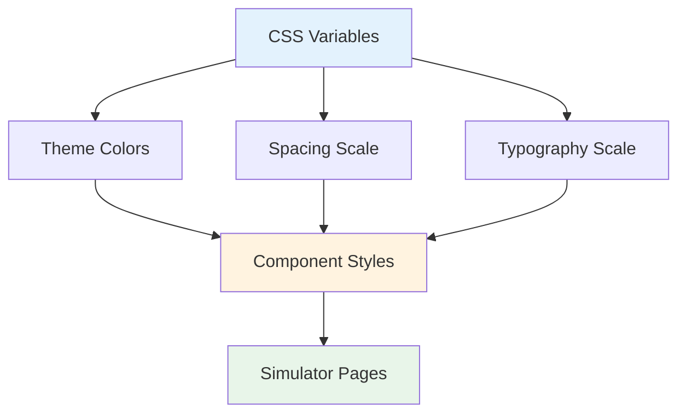

### Design Tokens

```css
:root {
    /* Colors */
    --primary: #3b82f6;
    --secondary: #8b5cf6;
    --success: #22c55e;
    --danger: #ef4444;

    /* Spacing */
    --space-xs: 0.25rem;
    --space-sm: 0.5rem;
    --space-md: 1rem;
    --space-lg: 2rem;

    /* Typography */
    --font-sans: system-ui, sans-serif;
    --font-mono: 'SF Mono', monospace;
}
```

---

## JavaScript Architecture

### Module System

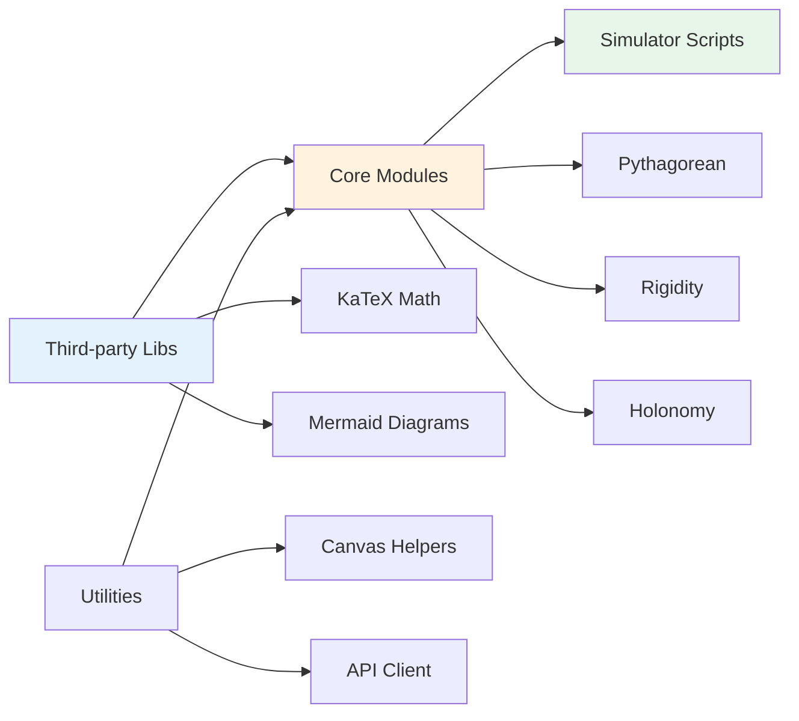

### Libraries

- **KaTeX** - Math rendering
- **Mermaid.js** - Diagrams
- **Canvas API** - Graphics
- **WebGL** - GPU acceleration (future)

---

## Deployment

### Architecture

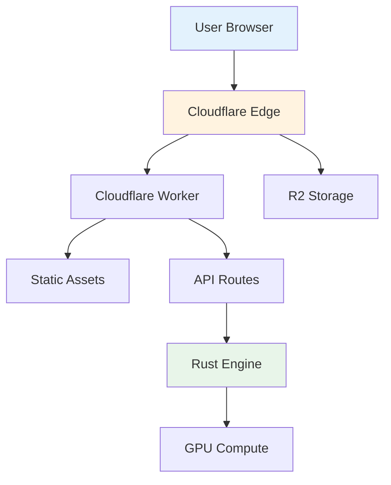

### Local Development

```bash
# Serve static files
npx serve web -p 8080

# Or Python
python -m http.server 8080 --directory web
```

### Production Deployment

1. **Cloudflare Workers** - Built-in responses
2. **Cloudflare R2** - Object storage (optional)
3. **CDN** - Edge caching

---

## Performance Optimization

### Optimization Strategies

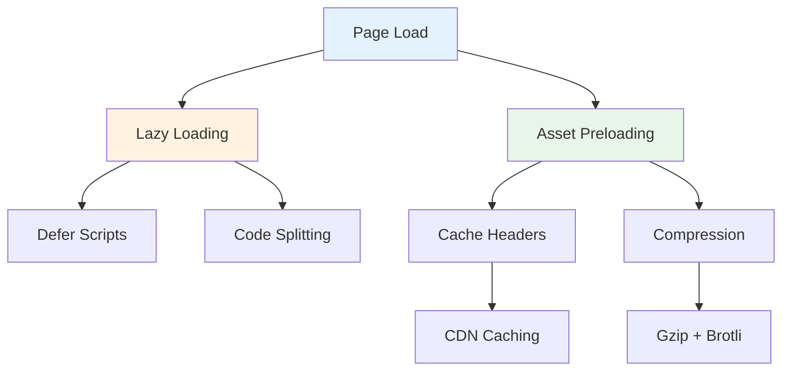

### Best Practices

1. **Defer JavaScript**
   ```html
   <script src="app.js" defer></script>
   ```

2. **Preload Critical Assets**
   ```html
   <link rel="preload" href="css/main.css" as="style">
   ```

3. **Cache Strategy**
   - Static: 1 year
   - API: 5 minutes
   - Version updates: `app.v2.js`

4. **Compression**
   - Gzip enabled
   - Brotli optional

---

## Browser Support

### Target Browsers

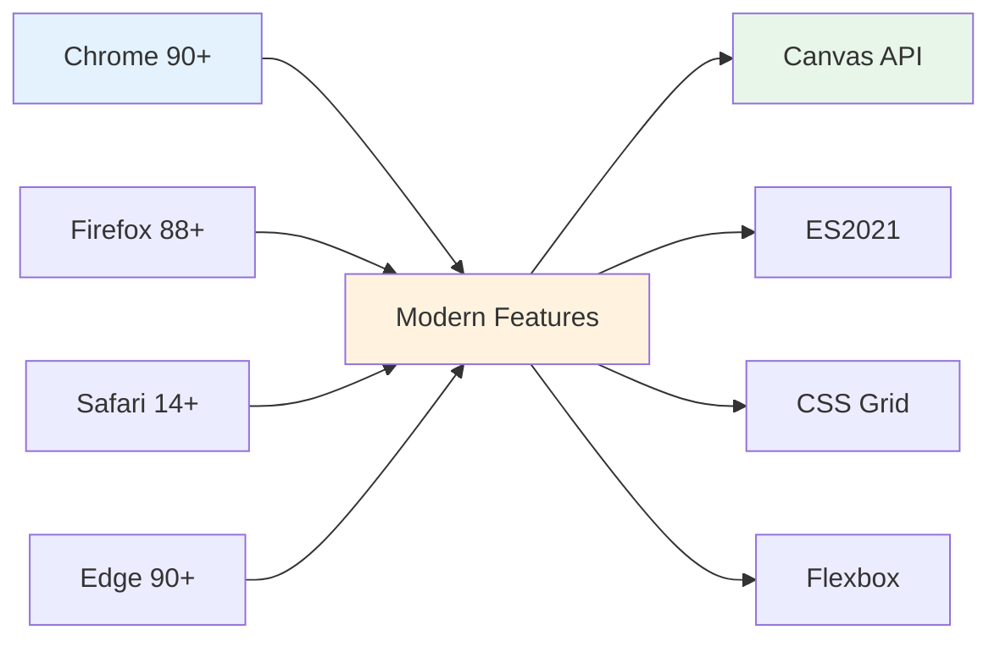

### Features Used

- Canvas API
- ES2021 JavaScript
- CSS Grid & Flexbox
- Web Workers (optional)

---

## Testing

### Test Strategy

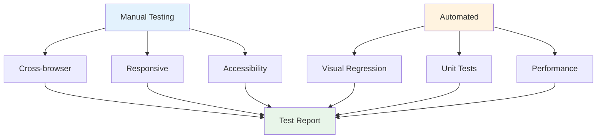

### Test Commands

```bash
# Visual regression tests
npm test

# Manual browser test
open http://localhost:8080
```

---

## Accessibility

### ARIA Implementation

```html
<!-- Buttons -->
<button aria-label="Reset simulation">Reset</button>

<!-- Canvas -->
<canvas role="img" aria-label="Pythagorean snapping visualization"></canvas>

<!-- Interactive elements -->
<button aria-pressed="false">Toggle</button>
```

### Keyboard Navigation

- Tab order: Logical and consistent
- Focus indicators: Visible
- Shortcuts: Documented

---

**Last Updated:** 2026-03-16
**Version:** 1.0.0
